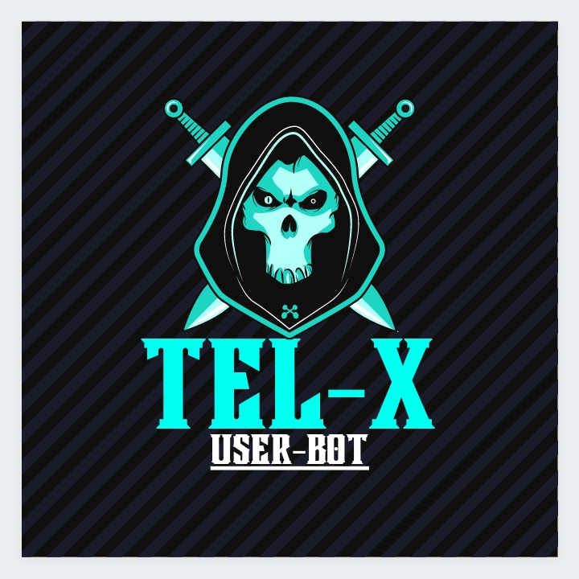

  

<h1 align="center">
  <b>𝐓𝐄𝐋-𝐗 𝐔𝐬𝐞𝐫𝐁𝐨𝐭</b>
</h1>

<b>A stable pluggable 𝙏𝙚𝙡𝙚𝙜𝙧𝙖𝙢 𝙪𝙨𝙚𝙧𝙗𝙤𝙩</b>  

___________

# Deploy
- [Heroku](#Deploy-to-Heroku)

## Deploy to Heroku
Get the [Necessary Variables](#Necessary-Variables) and then click the button below!  

## Necessary Variables
- `API_ID` - Your API_ID from [my.telegram.org](https://my.telegram.org/)
- `API_HASH` - Your API_HASH from [my.telegram.org](https://my.telegram.org/)
- `SESSION` - SessionString for your accounts login session. Get it from [here](#Session-String)
- `REDIS_URI` - Redis endpoint URL, from [redislabs](http://redislabs.com/), 
- `REDIS_PASSWORD ` - Redis endpoint Password, from [redislabs](http://redislabs.com/), 

## Session String
Different ways to get your `SESSION`:
* 
* Linux : `bash -c "$(curl -fsSL https://del.dog/ultroid)"`
* PowerShell : `cd desktop ; wget https://git.io/JY9JI ; python ultroid.py`
* Termux : `sh -c "$(curl -fsSL https://da.gd/termux-tel)"`
